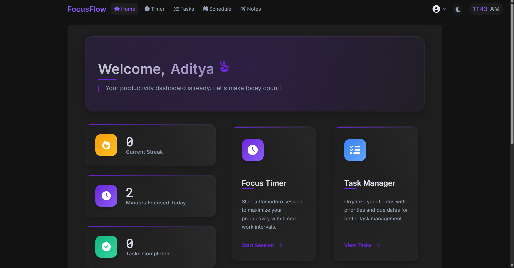
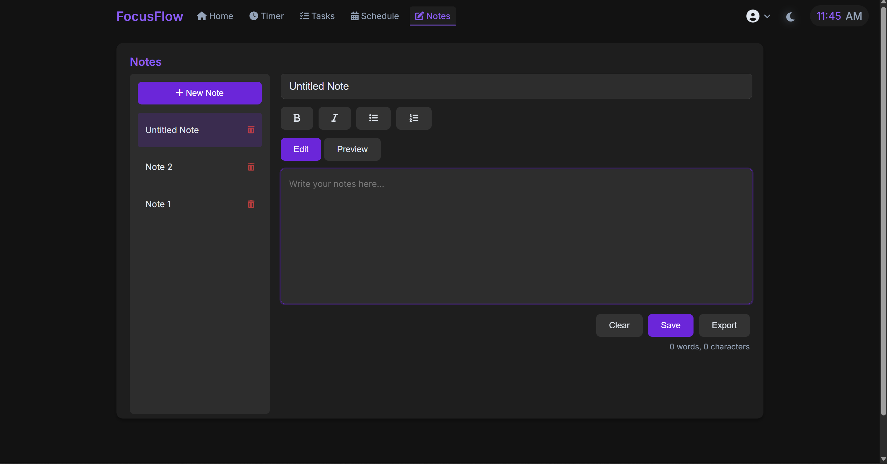
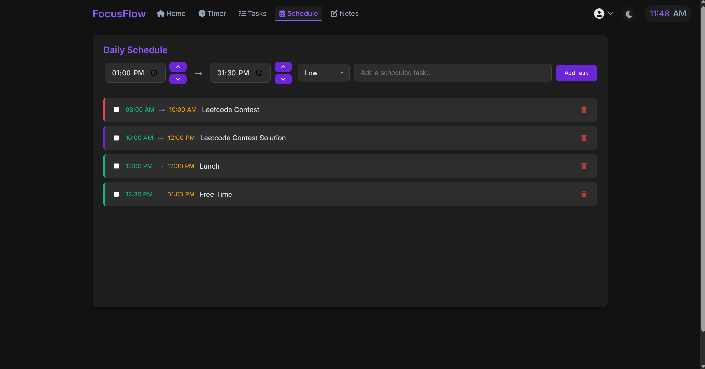
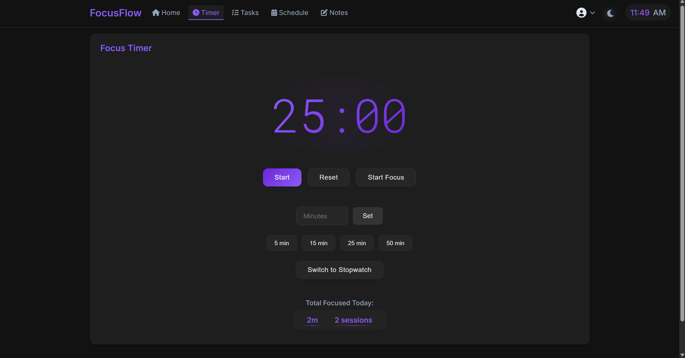

# 🌟 FocusFlow – Productivity Web App

**FocusFlow** is a clean, responsive, and interactive productivity website built using **HTML**, **CSS**, and **JavaScript**. Designed to help users stay organized and focused, it offers multiple tools in one intuitive interface.

---

## 🚀 Features

- ⏱️ **Pomodoro Timer** – Stay focused using time-boxed work intervals  
- ⌛ **Stopwatch** – Track time accurately for sessions or activities  
- 🗓️ **Schedule Planner** – Visual layout for managing daily tasks  
- ✅ **Task Manager** – Add, edit, delete, and complete to-do items  
- 📝 **Notes Section** – Jot down quick notes and ideas  
- 🔐 **Login/Logout Pages** – Simulated navigation for user flow  
- 📱 **Responsive Design** – Optimized for mobile and desktop use  
- 🎨 **Elegant UI** – Sleek, minimal, and distraction-free interface  

---

## 📸 Screenshots

### 🏠 Home Page  

### 📝 Notes Section  

### 📅 Schedule Planner  

### ⏱️ Pomodoro Timer  

---

## 🔧 Tech Stack

- **HTML5** – Markup and structure  
- **CSS3** – Styling using Flexbox, Grid, animations  
- **Vanilla JavaScript** – Functional logic and DOM interactions  

---

## 💬 Feedback

If you find this project useful, feel free to ⭐ it and share feedback. Contributions are welcome!

